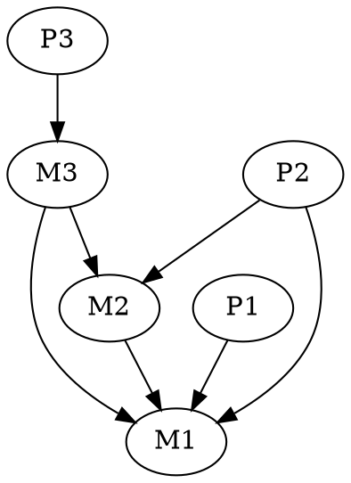

# Loading ESP and ESM files

## The Dependency Structure

`record::Record`s are introduced into the game by plugin (esp) and master (esm)
files. These are not two different file formats, rather esm files are
distinguished from esp files by a flag in their `record::TES4` record, which is
required to be present. Conventionally we will refer to both esp and esm files
as 'esp files' when the distinction doesn't matter.

Multiple such files are allowed to be loaded simultaneously, in which case they
have a defined load order; master files always come first, then the master and
plugin files are sorted separately by modification date, with older files
occurring before newer ones. Both plugin files and master files may have master
files as dependencies; because master files must be loaded first, this cannot be
weakened to allow master files to depend on plugins. The word 'masters' is
therefore used interchangeably with 'dependencies'. It is a critical error if a
file occurs earlier in the load order than any of its dependencies.

If master files were not allowed to have masters themselves, then the potential
problem of circular dependencies would be avoided. Unfortunately, master files
*are* allowed to depend on other masters and thus cycles may occur; this is a
critical error, and the program is not required to continue. Explicitly, if a
dependency graph is constructed by drawing an edge from file `A` to file `B` iff
`A` is a parent of `B`, then the graph must be a DAG, and all plugin files must
be sinks.

The first file in the load order is assigned a *mod index* of `0`, and each
subsequent file has a mod index one greater than the file preceding it. A
maximum of `256` files may be loaded simultaneously, meaning that the mod index
fits within a byte. This gives a way to guarantee uniqueness of `oo::FormId`s
introduced by a file, and also allows files to override records introduced by
files earlier in the load order. Specifically, the highest-order byte of every
`oo::FormId` is the mod index of the file that introduced it.

The load order and dependency graph discussed above are global to the program.
Each file also has its own local load order and dependency graph determined by
its masters. This way a file can modify the records introduced by other files
without knowing the full load order of the program. All `oo::FormId`s given in a
file have mod indices determined by the file's local load order. When loading
the file, these local mod indices are replaced by the global mod indices
determined by the position of the masters in the full global load order. Note
that transitive dependencies do not need to be included in the local load order
if they are not used. That is, if a plugin depends on a master `M1` which
depends on a master `M2`, but the plugin only overrides records introduced by
`M1`, not records in `M1` that are overrides of records in `M2`, then the plugin
does not need to have `M2` as a master.

## Example

Suppose that there are three master files `M1.esm`, `M2.esm`, and `M3.esm`,
and three plugin files `P1.esp`, `P2.esp`, and `P3.esp`. Suppose that
 - `M1.esm` has no masters
 - `M2.esm` depends on `M1.esm`
 - `M3.esm` depends on both `M1.esm` and `M2.esm`
 - `P1.esp` depends on `M1.esm`
 - `P2.esp` depends on both `M1.esm` and `M2.esm`
 - `P3.esp` depends on `M3.esm`.
The global dependency graph is then


Valid global load orders of these files correspond to topological orderings of
the dependency graph, subject to the requirement that no plugin file occurs
before a master. One such example is
```
00 M1
01 M2
02 M3
03 P1
04 P2
05 P3
```
Note that while multiple valid load orders may exist, different valid orders can
produce different results. For example, `P1.esp` and `P2.esp` both depend on
`M1.esm`. It could be that `P1.esp` modifies records in `M1.esm` whereas
`P2.esp` only uses them, or it could be that both plugins modify the same record
in `M1.esm` in different ways. Loading `P1.esp` before `P2.esp` would accept
`P2.esp`'s changes to the record and discard all of `P1.esp`'s, and vice-versa.

Consider the plugin `P2.esp`. It has masters `M1` and `M2` so has two potential
load orders,
```
00 M1
01 M2
02 P2
```
and
```
00 M2
01 M1
02 P2
```
however the second is not valid as `M1` is also a master of `M2`, and so must be
loaded first. While transitive dependencies are not required to be masters to a
file if they are not used directly, if a file included as a master happens to be
a dependency of another master, then that relationship must be respected in the
local load order. In other words, every local load order must be a restriction
of the global load order.

Any new records in `P2.esp` will therefore have the mod index `02`, whereas
records with the indices `00` and `01` correspond to modifications or usages of
records in its masters. When loading the records in `P2.esp`, the mod indices
get translated as
```
local|global
-----|------
   00|    00
   01|    01
   02|    04
```

`P3.esp` on the other hand has a local load order
```
00 M3
01 P3
```
and therefore has its mod indices translated by
```
local|global
------------
   00|    02
   01|    05
```
Even though `M2.esm` is a dependency of `M3.esm`, because `P3.esp` does not
include `M2.esm` as a master, it cannot use or modify any record in `M3.esm`
that was not introduced in `M3.esm`. Because every file always occurs as the
last entry in its load order, every file has local (to itself) mod index `n`,
where `n` is its number of masters. Thus `P3.esp` may only refer to records in
`M3` which have mod index `02` (the number of masters of `M3.esm`, or its
number of out edges in the dependency graph).

## Performing the Loading

In principle, loading the records in the files is simple given a valid load
order; each file is read in sequence and a map from its local load order to the
global load order is defined by looking up the names of the listed masters in
the global order. Each record is read and all its `oo::FormId`s translated using
the local-to-global map. If the `oo::FormId` of a record itself (not those
*used* by the record) is already known by the Resolver for its type then the
record is completely overwritten, otherwise it is simply added. While it is not
an error for two plugins to overwrite the same record, the order may not be what
the player intended so it could deserve a warning. A simple way to implement
this would be to have a flag for each record that is modified by a plugin. If a
record is modified and the flag already set, then a warning should be issued.
The flags can be kept separately from the Resolvers and discarded once loading
finishes.

For record types with deferred loading, the mod index of the record's
`oo::FormId` maps into the load order to determine which file to read the record
from when necessary. Due to OS limits on the number of open files, it is not
possible to have every plugin/master file open simultaneously. Instead there
must some coordinator instance which manages the actual io and keeps only a few
streams open at once. These can be read in parallel (whether that actually
provides a performance increase is questionable). To load a deferred record, the
Resolver calls a method of the coordinator, passing in the mod index of the file
it wishes to read. This may block while other reads complete if there are no
spare streams to open.
